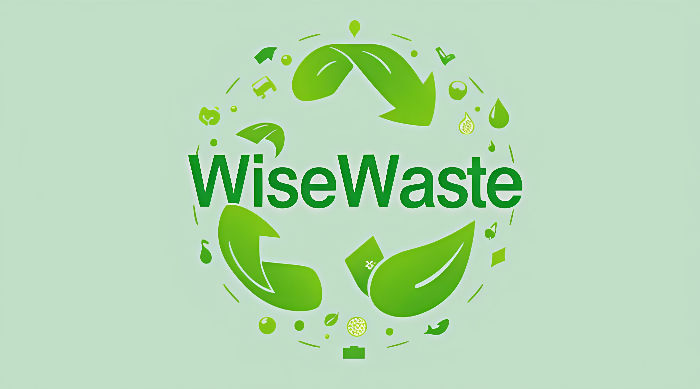

# WiseWaste  

**Connecting Communities to Turn Waste into Value**  

  

  

WiseWaste is an innovative platform designed to **reduce waste and transform it into value** through smart categorization, community collaboration, and sustainable practices. By addressing food waste, water mismanagement, and sanitation gaps, WiseWaste empowers individuals and communities to build a circular economy.  

## The Challenge  
Global waste crises threaten ecosystems and human well-being:  
- **Food Waste**: 1.3 billion tons of food are wasted annually, fueling environmental and economic losses.  
- **Water Mismanagement**: Over 2 billion people face water scarcity, with billions of gallons wasted daily.  
- **Sanitation Gaps**: Poor sanitation affects billions, leading to health crises and environmental degradation.  

## Our Solution  
WiseWaste tackles waste through **technology-driven resource optimization and community action**:  
- **Food Redistribution**: Share surplus food with local communities or charities.  
- **Water Repurposing**: Track usage and learn to recycle greywater for sustainable reuse.  
- **Sanitation Advocacy**: Access tools to improve waste disposal and hygiene practices.  
- **Educational Hub**: Guides and workshops on waste reduction and circular economy principles.  

## Features  
- 🍎 **Food Sharing Network**: Connect with local organizations to donate excess food.  
- 💧 **Water Smart Tools**: Monitor usage and discover repurposing techniques.  
- 🧼 **Sanitation Tracker**: Get personalized tips for improving waste disposal and hygiene.  
- 📚 **Learning Modules**: Interactive courses on composting, recycling, and sustainable living.  
- 🤝 **Community Boards**: Collaborate on local clean-up drives or resource-sharing initiatives.  
- 🌱 **Impact Dashboard**: Track your waste reduction progress and environmental savings.  

## Mission  
Our mission is to **transform waste into resources** by bridging gaps between individuals, communities, and sustainable practices. We aim to create a world where every wasted item becomes an opportunity for collective growth.  

## How It Works  
1. **Categorize Waste**: Log food, water, or sanitation waste types in the app.  
2. **Act Sustainably**: Donate food, repurpose water, or adopt hygiene practices.  
3. **Engage Communities**: Join local initiatives or start your own waste-reduction project.  
4. **Learn & Grow**: Complete modules to earn badges and unlock advanced tools.  
5. **Track Impact**: Visualize your contribution to reducing global waste.  

## Impact  
- **Reduced Food Waste**: Redirect surplus food to combat hunger and lower methane emissions.  
- **Water Conservation**: Promote efficient usage and repurposing in water-scarce regions.  
- **Healthier Communities**: Improve sanitation to reduce disease spread.  
- **Circular Economy**: Turn waste into reusable materials, reducing landfill dependency.  
- **Global Collaboration**: Foster a network of eco-conscious individuals and organizations.  

**Join the movement to reimagine waste—one sustainable action at a time.**  

Made with ❤️ for a cleaner, greener planet.  
